<div align="center">
  
  <p>
    <a href="https://go.dev/"></a>
    
    
     
  </p>
</div>


---

 **English** | [中文](./README_CN.md) 

> **A minimalist control plane focusing on Distributed Consistency (Outbox Pattern) and End-to-End Millisecond Latency (Etcd Watch).**

## 📖 Introduction

This project aims to build a **reliable, low-latency** core for microservice configuration distribution.

1. **Etcd Watch**: Utilizing Etcd's Watch capability for **low-latency updates**, replacing traditional polling.
2. **Outbox Pattern**: Implementing the Transactional Outbox pattern to ensure eventual consistency between MySQL and Etcd.
3. **Reconciler**: A background daemon (similar to a K8s Controller) that automatically remediates data drift.

## 🏗 Architecture

```mermaid
graph TD
    subgraph Client ["Client Integration"]
        SDK[("Mizu SDK")]
        App["Host Application"]
        LocalCache["Local Snapshot"]
        
        SDK -.->|Read| LocalCache
        SDK -->|Provide Flag| App
    end

    subgraph Service ["MizuFlow Core"]
        API["API Gateway"]
        OutboxWorker["🔄 Outbox Worker"]
        Reconciler["⚖️ Reconciler"]
        Hub["📡 Event Hub"]
        
        API -->|SSE Stream| SDK
    end

    subgraph Storage ["Infrastructure"]
        MySQL[("MySQL<br>(Source of Truth)")]
        Etcd[("Etcd<br>(Coordinate)")]
    end

    %% Write Path
    User((Admin)) -->|1. Mutate| API
    API -->|2. Tx Commit| MySQL
    OutboxWorker -->|3. Poll| MySQL
    OutboxWorker -->|4. Publish| Etcd
    
    %% Watch Path
    Etcd -.->|5. Watch Revision| Hub
    Hub -.->|6. Push| API

    %% Resilience Path
    Reconciler -.->|Periodic Check| MySQL
    Reconciler -.->|Fix Drift| Etcd
```



## 🛠 Tech Stack

- **Core**: Go 1.24
- **Coordination**: Etcd v3.5
- **Consistency**: MySQL 8.0
- **Observability**: Prometheus Metrics

## 🚀 Getting Started

Spin up the entire stack with a single command:

```bash
docker-compose up -d --build
```

## 📦 Feature Status

| Feature | Status | Description |
|---------|--------|-------------|
| **Real-time Engine** | ✅ Ready | Millisecond-level propagation via SSE + Etcd Watch |
| **Data Consistency** | ✅ Ready | Transactional Outbox ensuring MySQL-Etcd consistency |
| **Multi-Tenancy** | ✅ Ready | Namespace and Environment isolation |
| **Auth & RBAC** | ⚠️ Basic | JWT (Console) & API Key (SDK) implemented; Mock user source |
