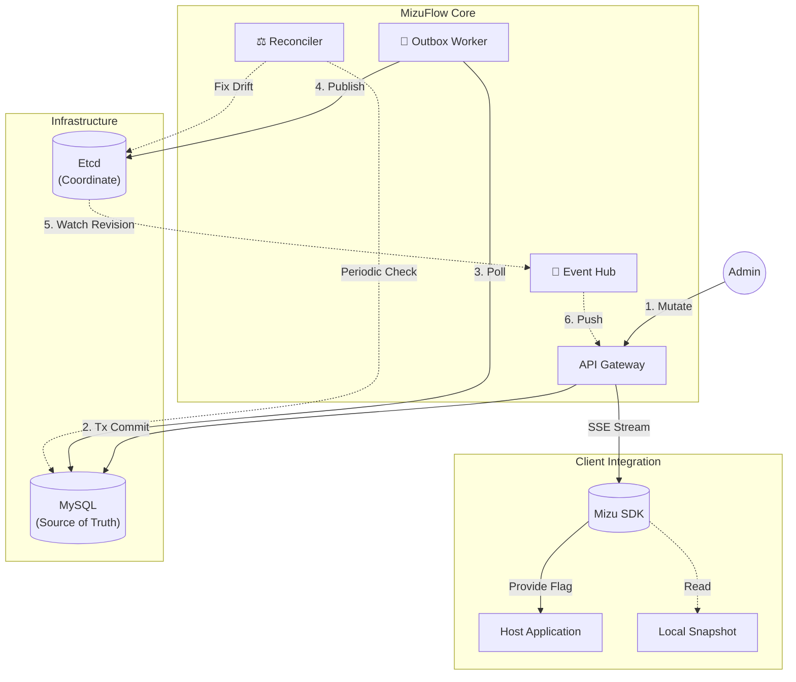

<div align="center">
  
  <p>
    <a href="https://go.dev/"></a>
    
    
    
  </p>
</div>

---

[English](./README.md) | **中文**

> **一个极简的控制面，用于在微服务中可靠地分发特征变更，基于 Outbox 模式保证一致性，并通过 Etcd Watch 实现低延迟更新。**

## 📖 Introduction

本项目旨在构建一个**高可靠、低延迟**的微服务配置分发核心。

1. **Etcd Watch**: 通过 Etcd Watch 推送配置变更，避免轮询带来的延迟和额外负载。
2. **Outbox Pattern**: 配置变更先落库，再通过事务性 Outbox 异步同步到 Etcd，用于保证 MySQL 与 Etcd 之间的最终一致性。
3. **Reconciler**: 类 Kubernetes Controller 的后台组件，用于在异常情况下修复配置状态不一致的问题。

## 🏗 系统架构



## 🛠 技术栈

- **Core**: Go 1.24
- **Coordination**: Etcd v3.5
- **Consistency**: MySQL 8.0
- **Observability**: Prometheus Metrics

## 🚀 快速运行

通过 Docker Compose 一键启动：

```bash
docker-compose up -d --build
```

## 📦 核心特性完成度

| 特性 | 状态 | 描述 |
|------|------|------|
| **Real-time Engine** | ✅ Ready | 基于 Server-Sent Events 的毫秒级推送 |
| **Data Consistency** | ✅ Ready | Outbox 模式保障 MySQL 与 Etcd 的最终一致性 |
| **Multi-Tenancy** | ✅ Ready | 命名空间与环境隔离 |
| **Auth & RBAC** | ⚠️ Basic | 包含 JWT 认证机制与 API Key 鉴权，暂使用 Mock 用户源 |
